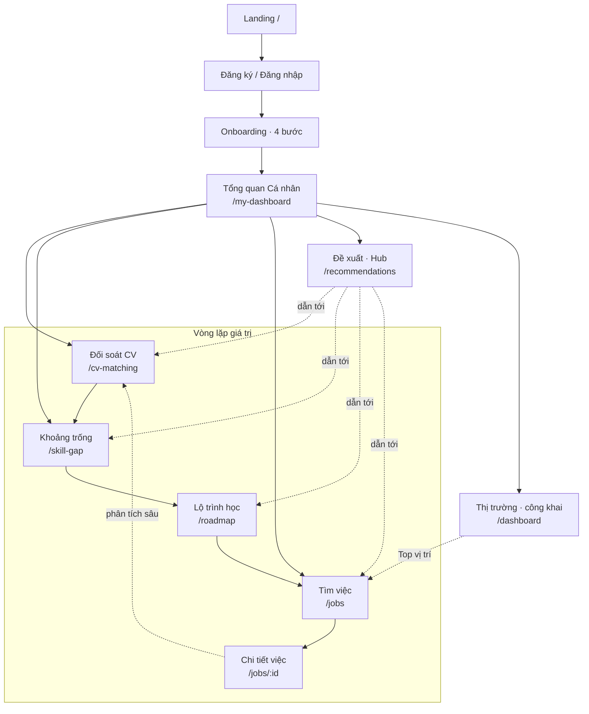

# Career Nova — User Flow & Test Guide

> Tài liệu mô tả luồng người dùng theo các tính năng hiện có, kèm **checkpoint kiểm thử (QA)** và **kịch bản user test**. Dùng cho team test và khảo sát người dùng (sinh viên IT).

---

## 0. Tổng quan & đối tượng

- **Người dùng:** sinh viên IT (đặc biệt năm cuối / chưa rõ định hướng).
- **Giá trị cốt lõi:** phân tích kỹ năng & việc làm IT → biết mình thiếu gì, hợp nghề nào, học gì tiếp.
- **2 nhóm trang:**
  - **Công khai (không cần đăng nhập):** Landing `/`, Thông tin Thị trường `/dashboard`.
  - **Cần đăng nhập:** còn lại (`/my-dashboard`, `/cv-matching`, `/skill-gap`, `/jobs`, `/roadmap`, `/recommendations`, `/profile`, `/settings`).

### Bản đồ luồng chính

**A. Luồng vào (mới):**
`Landing /` → `Đăng ký/Đăng nhập` → `Onboarding (4 bước)` → `Tổng quan Cá nhân /my-dashboard`

**B. Vòng lặp giá trị cốt lõi** (từ Tổng quan Cá nhân, lặp lại nhiều lần):
`Đối soát CV /cv-matching` → `Khoảng trống kỹ năng /skill-gap` → `Lộ trình học /roadmap` → `Tìm việc /jobs` → `Chi tiết việc /jobs/:id`

**C. Trang hỗ trợ (vào bất cứ lúc nào):**
- `Thị trường /dashboard` (công khai) — khám phá xu hướng, dẫn sang Tìm việc.
- `Đề xuất /recommendations` (hub) — tóm tắt & dẫn sang 3 trang ở vòng lặp B.
- `Hồ sơ /profile`, `Cài đặt /settings`.

**Sơ đồ (Mermaid — render trên GitHub/VS Code):**

> Tóm tắt: **Onboarding → Tổng quan Cá nhân (trung tâm)**, từ đó đi **vòng lặp: Đối soát CV → Khoảng trống → Lộ trình học → Tìm việc**. *Đề xuất* là hub tóm tắt dẫn vào vòng lặp; *Thị trường* là nơi khám phá công khai.

---

## 1. Luồng: Khách vào lần đầu (Landing)

**Mục tiêu:** hiểu web làm gì + quyết định đăng ký.

**Các bước:**
1. Vào `/` → thấy Hero ("Biết mình còn thiếu kỹ năng gì so với thị trường"), mục "Cách hoạt động 3 bước", số liệu thật (tin tuyển dụng/công ty), FAQ.
2. CTA: "Bắt đầu miễn phí" → `/auth/register`; "Xem Thông tin Thị trường" → `/dashboard` (không cần login).

**✅ QA checkpoint:**
- [ ] Số liệu social proof load thật (hoặc hiển thị "—" khi lỗi, không vỡ).
- [ ] FAQ mở/đóng được.
- [ ] Các CTA điều hướng đúng.
- [ ] Đã đăng nhập vào `/` → không hiện landing (chuyển hướng hợp lý).

---

## 2. Luồng: Đăng ký / Đăng nhập

**Đăng ký** (`/auth/register`): họ tên, email, mật khẩu (+ thanh độ mạnh), xác nhận mật khẩu, **checkbox điều khoản** (bắt buộc), social (Google).
**Đăng nhập** (`/auth/login`): email, mật khẩu (hiện/ẩn), quên mật khẩu, social.

**✅ QA checkpoint:**
- [ ] Mật khẩu yếu → thanh đỏ; không tích điều khoản → nút Đăng ký bị khóa.
- [ ] Mật khẩu xác nhận không khớp → báo lỗi rõ.
- [ ] Sai thông tin đăng nhập → thông báo lỗi tiếng Việt cụ thể.
- [ ] Skeleton hiển thị khi tải (không phải chữ "Loading...").
- [ ] Sau đăng ký → chuyển tới xác thực email; sau đăng nhập → về `next` hoặc trang chính.

---

## 3. Luồng: Onboarding (4 bước, có nhánh)

**Bước 1 — Về bạn:** ngành học (bắt buộc) + năm học (bắt buộc) + trường (tùy chọn).
**Bước 2 — Định hướng (nhánh):**
- **"Tôi đã rõ hướng"** → chọn 1–3 mảng quan tâm.
- **"Chưa rõ — giúp tôi khám phá"** → **bài trắc nghiệm RIASEC 18 câu** (Likert 5 mức, dựa Holland/O*NET).
**Bước 3 — Kỹ năng & CV (tùy chọn):** tải CV (tự nhận diện kỹ năng) hoặc khai báo tay; có thể bỏ qua.
**Bước 4 — Mục tiêu (tùy chọn):** giai đoạn nghề nghiệp + lương + remote; có thể bỏ qua → **Hoàn tất**.

**Màn kết quả:**
- Nếu làm quiz → **hồ sơ RIASEC** (mã + 3 nhóm trội + %) + nghề IT phù hợp.
- Nếu chọn tay → nghề theo lựa chọn.
- Cầu nối: "Xem lộ trình nghề nghiệp dựa trên CV" / "Tải CV & xem vai trò phù hợp".

**✅ QA checkpoint:**
- [ ] Tiến độ "Bước x/4" + thanh % đúng; nhãn 4 bước đúng.
- [ ] Bước 1 chưa đủ ngành+năm → "Tiếp tục" khóa.
- [ ] Bước 2: chưa chọn nhánh → khóa; nhánh "khám phá" chưa làm đủ 18 câu → khóa; nhánh "đã rõ" chưa chọn mảng → khóa.
- [ ] Bước 3 & 4: bỏ trống vẫn "Tiếp tục" được (tùy chọn).
- [ ] Tải CV xong → hiện "đã nhận diện N kỹ năng".
- [ ] Thoát giữa chừng rồi quay lại → đúng bước, dữ liệu còn (tiến độ lưu tự động).
- [ ] Hoàn tất → điều hướng `/my-dashboard`; kết quả RIASEC chỉ hiện khi đã làm quiz.
- [ ] Đã hoàn tất onboarding mà vào lại `/onboarding/welcome` → chuyển về trang cá nhân.

**🧪 User test task:** "Bạn chưa biết mình hợp nghề IT nào — hãy dùng web để tìm hiểu." → quan sát có chọn nhánh "Chưa rõ" + hiểu kết quả RIASEC không.

---

## 4. Luồng: Tổng quan Cá nhân (`/my-dashboard`)

**Người mới (chưa CV):** thẻ "Bắt đầu 3 bước" + nút lớn "Tải CV & bắt đầu" (ẩn các widget rỗng).
**Đã có CV:** thanh "Hành trình của bạn" (5 bước có trạng thái), quick stats (việc phù hợp / kỹ năng thiếu / hoàn thiện hồ sơ), lộ trình ưu tiên ("Học ngay"), radar kỹ năng, tab Tiến độ (chart điểm match theo thời gian).

**✅ QA checkpoint:**
- [ ] User chưa CV → chỉ thấy thẻ bắt đầu + hành trình, KHÔNG bị dội widget rỗng.
- [ ] Thanh hành trình: bước "đang ở đây" và trạng thái đúng; **không** hiện trùng thanh hành trình ở header.
- [ ] Radar: chọn "Tất cả nhóm" → tổng quan theo nhóm; **bấm tên nhóm** → drill xuống skill; <3 kỹ năng → đổi sang bar ngang.
- [ ] Chart tiến độ: cần ≥2 lần match mới hiện; <2 → thông báo.
- [ ] "Học ngay" mỗi kỹ năng → `/roadmap?skill=...`.

---

## 5. Luồng: Đối soát CV (`/cv-matching`) — cốt lõi

1. Chọn CV (mặc định/đã có/tải mới) + chọn **vai trò** hoặc dán **URL tin tuyển dụng**.
2. Bấm "Phân tích & So khớp" → **skeleton + mô tả bước** (trích xuất → đối soát → tính điểm).
3. Kết quả: **Điểm phù hợp** (có diễn giải "Khá tốt…"), Kỹ năng mạnh / một phần / thiếu (badge "liên quan tới X" khi tương đồng ≥60%), **radar** (overview theo nhóm, bấm để drill), **So sánh vai trò** (career-paths), CTA "Lấp đầy N kỹ năng → Lộ trình".
4. Modal kết quả phân tích mới + đặt CV mặc định.

**✅ QA checkpoint:**
- [ ] Chưa chọn CV/tải file → báo lỗi rõ.
- [ ] Loading hiện skeleton + 3 bước (không spinner trơ).
- [ ] Điểm phù hợp có câu diễn giải theo mức điểm.
- [ ] Mục "Tương thích một phần": hiện **% tương đồng** + tag "Bắt buộc/Ưa thích"; KHÔNG còn "cấp độ/năm kinh nghiệm" bịa.
- [ ] Badge "liên quan tới X" chỉ hiện khi ≥60% và tên khác.
- [ ] Radar overview bấm tên nhóm drill được; nhóm ít kỹ năng → bar ngang.
- [ ] "So sánh vai trò": hiện vai trò hợp hơn (badge), bấm "Đối soát vai trò này" chạy lại đúng.

**🧪 User test task:** "Tải CV và xem bạn hợp vị trí "Frontend Developer" tới đâu, còn thiếu kỹ năng gì."

---

## 6. Luồng: Khoảng trống kỹ năng (`/skill-gap`)

- Radar "Kỹ năng của bạn so với thị trường" (overview nhóm → drill; bar khi <3), Độ khớp theo danh mục, danh sách kỹ năng (mỗi cái có "Học ngay"), lộ trình học.
- Empty state có CTA "Bắt đầu đối soát CV" khi chưa có dữ liệu.
- Cuối trang: "Bước tiếp theo → Roadmap".

**✅ QA checkpoint:**
- [ ] Chưa match → empty state + CTA.
- [ ] Radar đồng nhất với CV Matching (badge, ngưỡng, bar fallback).
- [ ] "Học ngay" mỗi kỹ năng → roadmap đúng skill.
- [ ] Tooltip "(?)" giải thích độ tương đồng.

---

## 7. Luồng: Lộ trình học (`/roadmap`)

- 2 mục rõ vai trò: **"Lộ trình học theo chủ đề"** (chuỗi có thứ tự) và **"Khóa học lẻ gợi ý"** (cho kỹ năng thiếu).
- Vào từ `?skill=X` → banner ngữ cảnh "Lộ trình cho X".
- Cuối trang: "Bước tiếp theo → Tìm việc".

**✅ QA checkpoint:**
- [ ] `?skill=React` → banner ngữ cảnh đúng, lọc đúng.
- [ ] Không còn thanh "progress" giả (0/100 theo lưu).
- [ ] Tìm kiếm khóa học hoạt động; icon khóa học hiển thị (không vỡ ảnh).

---

## 8. Luồng: Tìm việc (`/jobs` + `/jobs/:id`)

- Tìm + lọc (hình thức, kinh nghiệm, địa điểm), chế độ "Phù hợp nhất" (theo CV).
- Vào từ Thị trường → **chip filter đang áp** (vị trí/7 ngày…) + xóa từng cái.
- Loading → **skeleton thẻ**; rỗng → EmptyState "Xóa bộ lọc".
- Chi tiết việc: **% phù hợp + breakdown** theo CV mặc định; chưa CV → CTA tải CV; lưu việc; "Phân tích sâu CV".

**✅ QA checkpoint:**
- [ ] Từ "Top vị trí tuyển nhiều" (Thị trường) → Jobs lọc đúng + chip hiện + số khớp.
- [ ] Lưu/bỏ lưu việc hoạt động (icon + aria-label).
- [ ] Chi tiết: chưa CV → CTA; có CV → breakdown mạnh/một phần/thiếu.

---

## 9. Luồng: Đề xuất - Hub (`/recommendations`)

- Trang **tổng hợp**: việc phù hợp, kỹ năng ưu tiên, lộ trình nghề, tài nguyên — mỗi mục **link sang trang chuyên sâu** (chống trùng lặp).
- Tab: "Đề xuất cho bạn" / "Báo cáo đã lưu" / "Tài nguyên học".

**✅ QA checkpoint:**
- [ ] Mỗi khối có link canonical (Jobs/Skill-gap/Roadmap).
- [ ] Empty states đồng bộ (EmptyState + CTA).
- [ ] Banner "Tóm tắt từ hồ sơ" bám dữ liệu thật (không câu sáo rỗng).

---

## 10. Luồng: Thị trường (`/dashboard`, công khai)

- Bộ lọc **dính** (khu vực / thời gian / hình thức) + ghi chú nguồn dữ liệu.
- Xu hướng tin tuyển dụng (badge "7/14/30 ngày qua" theo filter), Phân bổ thị trường (nhóm kỹ năng), **Top 5 vị trí tuyển nhiều nhất**, Top kỹ năng yêu cầu + Kỹ năng tăng nhanh (có câu kết luận hành động), Vị trí thực tập.
- Đã đăng nhập → banner cá nhân ("X việc khớp CV").

**✅ QA checkpoint:**
- [ ] Đổi filter thời gian → badge + dữ liệu đổi theo.
- [ ] Không còn dữ liệu lương gây nhiễu.
- [ ] "Top vị trí" → bấm dẫn sang Jobs đã lọc.

---

## 11. Luồng: Hồ sơ & Cài đặt

**Hồ sơ (`/profile`):** banner "CV đang dùng để so khớp", thẻ "Hồ sơ hướng nghiệp (RIASEC)" + "Làm lại bài test", quản lý CV (đặt mặc định), tabs Tổng quan/Skills&CV/Hoạt động.
**Cài đặt (`/settings`):** đổi mật khẩu (validation), xuất hồ sơ, xóa tài khoản (trang riêng), cross-link quyền riêng tư CV, feedback thành công/lỗi.

**✅ QA checkpoint:**
- [ ] Banner CV mặc định đúng; đổi CV mặc định cập nhật toàn app.
- [ ] Thẻ RIASEC hiện kết quả đã lưu; "Làm lại" → onboarding bước Định hướng.
- [ ] Đổi mật khẩu: lệch xác nhận → lỗi; thành công → banner xanh.

---

## 12. Ma trận kịch bản User Test (đề xuất 5–8 người)

| # | Persona | Nhiệm vụ | Thành công khi |
|---|---|---|---|
| 1 | SV chưa định hướng | "Tìm xem mình hợp nghề IT nào" | Tự làm RIASEC, hiểu kết quả, biết bước tiếp |
| 2 | SV đã có hướng | "Xem mình hợp Backend tới đâu" | Tải CV, đối soát, đọc được điểm + kỹ năng thiếu |
| 3 | SV tìm thực tập | "Tìm cơ hội thực tập phù hợp" | Dùng filter/Top vị trí, lưu việc |
| 4 | SV muốn học thêm | "Biết nên học gì tiếp" | Từ skill-gap → roadmap, thấy khóa học |
| 5 | Quay lại lần 2 | "Xem tiến bộ của tôi" | Thấy chart tiến độ, hành trình cập nhật |

**Câu hỏi sau test (Likert 1–5 + mở):**
- Bạn hiểu web này dùng để làm gì nhanh tới mức nào?
- Có chỗ nào khiến bạn bối rối/lạc không?
- Kết quả (RIASEC / điểm match / khoảng trống) có hữu ích & dễ hiểu không?
- Bạn có biết "bước tiếp theo nên làm gì" sau mỗi trang không?

---

## 13. Khu vực rủi ro cần test kỹ (đã biết)
- **Phụ thuộc CV mặc định**: nhiều tính năng (Jobs match, Skill-gap, Recommendations) dựa vào CV mặc định → test khi chưa có CV / đổi CV.
- **Dữ liệu thưa**: lương đã ẩn; `applies/views` có thể rỗng → chip tự ẩn; cần kiểm dataset thật.
- **matched_via ngữ nghĩa yếu**: badge "liên quan tới" có ngưỡng 60% — kiểm không gán nhầm (vd Java↔JavaScript thấp điểm).
- **Mobile**: radar/bảng cuộn, kích thước chạm, sidebar overlay.
- **Đồng bộ localStorage ↔ backend**: onboarding/RIASEC lưu localStorage; test xóa cache/đổi máy.

---

*Tài liệu phản ánh trạng thái sau các đợt chuẩn hóa UX (SkillRadar/EmptyState/InfoTooltip dùng chung, onboarding 4 bước + RIASEC, hub Đề xuất, bỏ số liệu bịa). Tham chiếu kèm: DESIGN_HANDOFF.md.*
